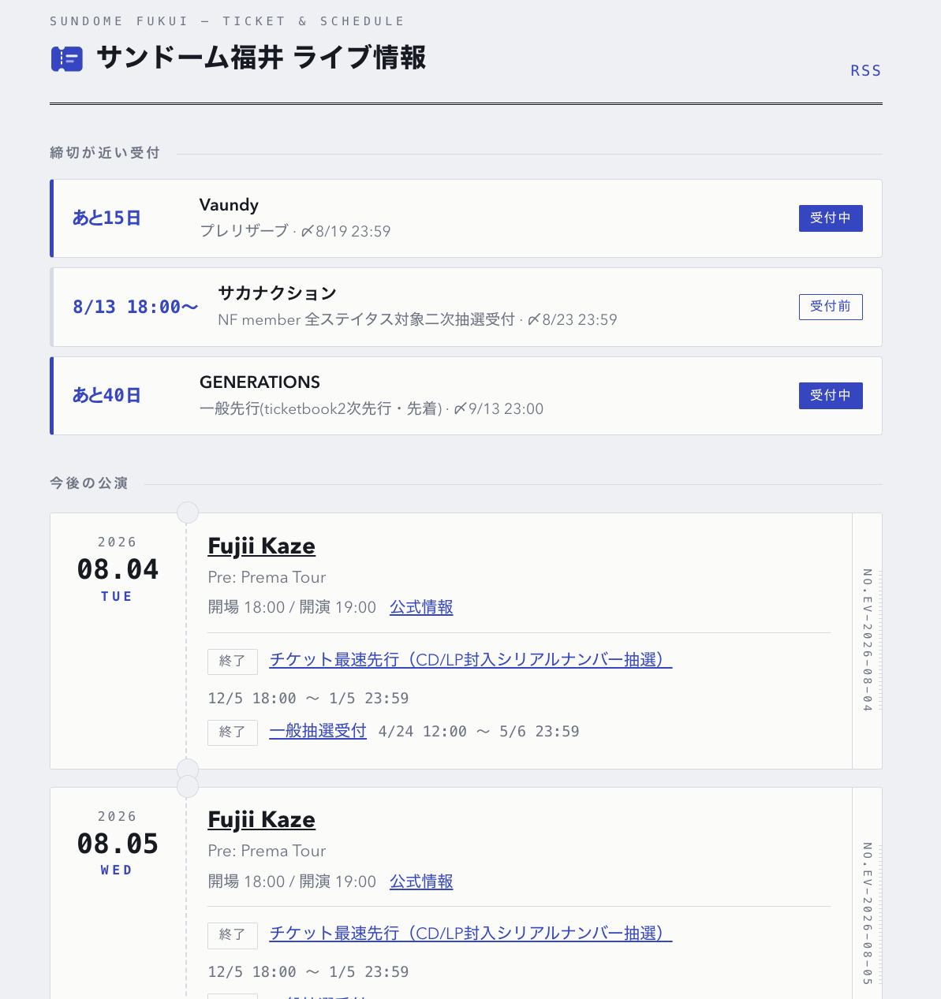

<!-- _class: lead -->
<!-- _paginate: false -->

# 推しの来鯖を見逃さない！<br>サンドーム福井ライブスケジュールアプリを作った話🎤

<p class="by">jig.jp 美園武蔵</p>

---

## 自己紹介

<div class="split">
<div>

**美園武蔵** / jig.jp

- Web アプリ開発
- 自作キーボードとイベントが好き

</div>
<div>


</div>
</div>

<!--
先日のLTと同じ自己紹介。写真は前回資料から流用。
必要なら me-keyboard.jpg / me-fuwachi.png に差し替えられる。
-->

---

## 私の推し

「タイトルに**推し**を入れてほしい」と言われて、考えてみました

| ジャンル | 推し |
|---|---|
| スポーツ | ⚾️ 大谷翔平 さん / 岡本和真 さん |
| アーティスト | 🎤 **藤井風** さん |
| 人生 | 💐 妻 |

→ 今日は **藤井風さん**の話から始まります

<!--
LTのルールでタイトルに「推し」を入れる必要があった。
自分の推しって何だろう?と考えたら、スポーツ・音楽・人生で出てきた。
選手の画像は著作権があるので絵文字とテキストだけにしている。
-->

---

## 藤井風さんのコンサート

**8/4(火)・8/5(水)**<br>@ サンドーム福井

SNS をフォローしていたので<br>**8/5(水) のチケットが取れました**


<!--
実際に行ってきた話。SNSをフォローしていたから先行に間に合った。
逆に言うと「フォローしていないアーティストは気づけない」という話に繋げる。
-->

---

## 動機

## 「今日サンドームに〇〇さん来るらしいよ!」

- こういう情報を **直前に知ることが多い**
- 知ってたら行きたかったな… が何度もあった
- 推しの SNS はフォローできても、**全アーティストは追えない**

→ **サンドーム福井の公演予定とチケット受付期間**を
まとめて見られるサイトを作りました

<!--
動機。フォローしている推しは追えるが、それ以外は直前に人から聞いて知る。
「来ることを知ってたら行きたかった」を無くしたい。
-->

---

## 作ったもの

**sundome.take20m.dev**

<p class="cap">公演一覧と<br>販売中のチケット情報<br>+ RSS フィード</p>



<!--
【ここでライブデモ 60秒】
1. トップ:「販売中のチケット」— 受付中を締切順、カウントダウン付き
2. 本日公演のマーカー、売り切れ表示
3. 公演詳細 → チケット受付の一覧
4. Slack の RSS 通知チャンネル
※デモが動かない場合はこのスクショで説明する
-->

---

## 仕組み

```
GitHub Actions (毎晩 JST 3:30)
  └─ claude -p collector/prompt.md   ← 調査手順を日本語で書いたファイル
       WebSearch / WebFetch で調べて events.json を書く
  └─ POST /api/ingest ─→ Cloudflare Workers + D1(配信)
```

- 収集の実体は **`claude -p` を1回叩くだけ**。調査手順は Markdown
- `claude -p` は **Claude のサブスク枠で動く** → LLM の API 課金 **¥0**
- 運用コストはドメイン代のみ(Workers / D1 / Actions は無料枠)

<!--
アーキテクチャ。収集ロジックはコードではなくMarkdownの指示書、という点を強調。
API課金ゼロも受けがいい。
-->

---

## 工夫① 収集は両方向から

### 会場起点

会場公式カレンダーで公演を確定 → 公演ごとにチケット受付期間を**逆引き検索**

### 発見起点

「"サンドーム福井" ツアー 2026 / 2027 /
2028」等で、**会場公式に載る前の公演**を探す

### さらに2段ロケット

1. **広く浅く** … 全公演を一括収集(1公演あたり検索2〜3回)
2. **狭く深く** … 期間が取れなかった公演を抽出し、**アーティスト単位で集中調査**

<!--
収集の工夫。全公演を1セッションで回すと注意が薄まってチケット特設ページまで
掘る余力が残らない。だから欠けたところだけ翌晩狙い撃ちする2段構え。
-->

---

## 工夫① 公式に載る前に捕まえられた

会場公式カレンダーは **2026年11月まで**しか載っていなかった

| 発見した公演          | 会場公式 | 結果                                |
| --------------------- | -------- | ----------------------------------- |
| Vaundy 2027/12        | 未掲載   | **ぴあ先行が受付中**なのを検知      |
| あいみょん 2027/2     | 未掲載   | 公式が coming soon の段階でキャッチ |
| サカナクション 2027/4 | 未掲載   | NF先行4種を期間付きで追跡           |

> 「公式カレンダーに載る前の公演の、いま受付中の先行」

<!--
成果。実際に先回りできた3例。
Vaundyは発見した時点でぴあ先行が受付中だった。これが一番おいしい。
-->

---

## 工夫② LLM は毎晩ちょっと違うことを言う

同じプロンプト・同じ情報源でも、**出力は揺れる**

| 症状           | 実際に起きたこと                                                      |
| -------------- | --------------------------------------------------------------------- |
| **表記ゆれ**   | `FANTASTICS` と `FANTASTICS from EXILE TRIBE` → 同じ公演がDBに2件     |
| **値の欠落**   | 昨日取れていた受付期間が今日は `null` → 上書きで消えた                |
| **改名**       | `NF member 一次抽選` → `全ステイタス対象1次抽選受付` → 別物として増殖 |
| **取りこぼし** | 20件取れる夜と19件の夜 → 消えた行が翌晩「新規」で復活                 |

<!--
ここが本題。LLM収集の敵は「間違い」ではなく「揺らぎ」。4つとも実際に踏んだ。
最後の取りこぼしは、購読者に「新規発見」の誤通知が飛ぶ形で表に出た。
-->

---

## 工夫② 一方向にしか変わらないようにする

### 識別子を LLM に作らせない

`ev-2026-10-11` … **日付が主キー**(単一ホールなので1日1公演)<br> 受付は
**正規化した名前**のハッシュ + 期間一致で同一判定

### ラチェット(状態は良くなる方向にしか動かない)

```
null で既知の値を上書きしない
official を「推定」に格下げしない
期間付きの行は、期間を取れている収集でしか消せない
2回連続で収集から漏れるまで削除しない   ← 削除にもラチェット
```

<!--
対策。全部「一方向にしか変わらない」という一つの原則で説明できる。
ラチェットは値のマージだけでなく、行の削除にも必要だった(最後に気づいた)。
-->

---

## 工夫② 通知は「行動できる差分」だけ

- 差分検知の**材料から名前・URLを除外** … 表記が揺れても通知しない
- 過去公演 / 締切済み / 期間が全く不明の受付は**通知しない**

### 毎晩 30〜95 件 → **2 件**

取り込みは貪欲に、通知はけちに。**DBには全部入れて、知らせるのは動けるものだけ**

<!--
通知の数字が一番わかりやすい成果。毎晩90件流れていたSlackが、いまは本物だけ2件。
「取り込みは貪欲に、通知はけちに」がこの設計の合言葉。
-->

---

## まとめ

- **LLM は「毎回ちょっと違うことを言う」前提で組む**
  - 間違いより揺らぎが厄介。冪等性は自分で作る
- **識別子を LLM に作らせない**
  - 決定的なキー + 正規化で表記ゆれを吸収
- **状態は一方向にしか変えない**
  - 値も、行の存在も。事故っても最悪「現状維持」
- **通知は「行動できる差分」だけ**

<span class="url">sundome.take20m.dev</span> / コードも公開しています 🎫
_github.com/take20m/sundome-live-schedule_

<!--
まとめ。原則4つ。
構築はほぼ一晩、運用コストはドメイン代だけ。質問は懇親会で。
-->
